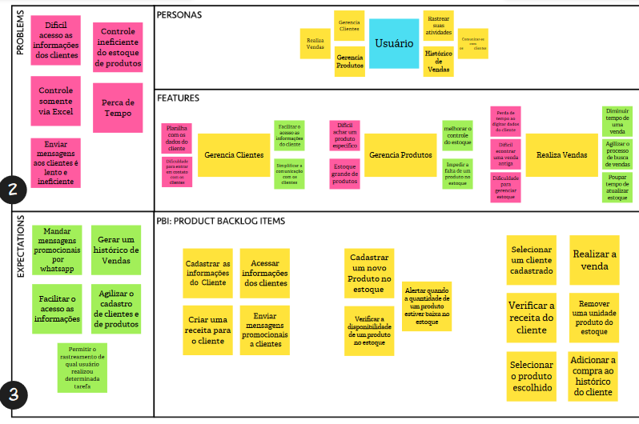

# PBB Canvas
## Histórico de Versões
|    Data    | Versão |      Descrição       |               Autor(es)               |
| :--------: | :----: | :------------------: | :-----------------------------------: |
| 15/06/2023 |  0.1   | Criação do documento | [Renato](https://github.com/Osidious) |
| 19/06/2023 | 0.2    | Refatoração documento| [Ana Luíza](https://github.com/analufernanndess)

## 1. Product Backlog Building (PBB)
O Product Backlog é uma lista priorizada de requisitos, funcionalidades, melhorias e correções que devem ser implementados em um produto.
### 1.1. Imagem do documentos Product Backlog Building (PBB Canvas):

[Link de Acesso](https://app.mural.co/invitation/mural/sosoptica6826/1685642033815?sender=ufb6e8eb01dfe7140ecd54997&key=c0eb5fb8-534d-48f3-9867-9e3e8322f53e)

 

