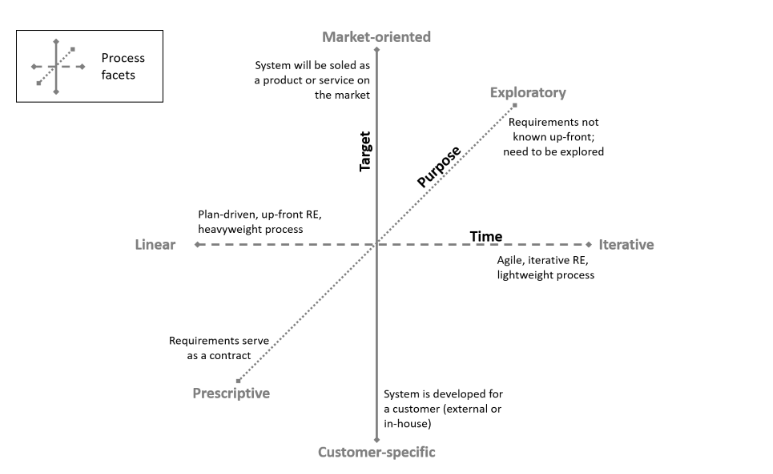

<h1 align="center"><b>VISÃO DO PRODUTO E PROJETO</b></h1>

## Histórico de Revisão

| **Data** | **Versão** | **Descrição** | **Autor** |
|---|---|---|---|
| 15/04/2023 | 0.1 | Criação do documento | [Ana](https://github.com/anafernanndess), [Renato](https://github.com/Osidious), [Ana](https://github.com/anafernanndess), [Tales](https://github.com/TalesRG) e [Weslley Barros](https://github.com/weslley17w) |
| 16/04/2023 | 0.2 | Adiciona as seções 1.3 e 2.1 | [Ana](https://github.com/anafernanndess), [Renato](https://github.com/Osidious), [Ana](https://github.com/anafernanndess), [Luis](https://github.com/luishenrrique), [Tales](https://github.com/TalesRG) e [Weslley Barros](https://github.com/weslley17w) |
| 26/04/2023 | 0.3 | Adiciona as seções 3.1 e 3.2 | [Renato](https://github.com/Osidious)|
| 26/04/2023 | 0.4 | Adiciona a seções 2.2 | [Weslley Barros](https://github.com/weslley17w)|
| 27/04/2023 | 1.0 | Adiciona a seções 2.2 | [Weslley Barros](https://github.com/weslley17w), [Renato](https://github.com/Osidious)|
| 24/05/2023 | 1.1 | Refatorando Visão | [Ana Luiza](https://github.com/analufernanndess)|

## 1 VISÃO GERAL DO PRODUTO
### 1.1 Declaração de Posição do Produto

|  |  |
|---|---|
| Para | Optica Opção |
| Quem | Necessita de mais eficiência no gerenciamento de clientes |
| O SOSóptica | É um software voltado para gerenciar os clientes da Óptica Opção  |
| Que | Ajuda a ótica gerenciar seus clientes facilitando encontrar dados do cliente e enviar mensagens de formas automáticas. |
| Ao contrário | [ssOtica](https://ssotica.com.br/) que é voltada para gerenciamento de clientes, estoques. |
| Nosso produto | produto é webservice para gerenciamento de clientes da Óptica Opção |

### 1.2 Objetivos do Produto
  - Antes de cada sprint, a equipe de desenvolvimento se reunirá em uma reunião de planejamento (planning), com o objetivo de identificar as tarefas a serem executadas durante a sprint em questão. 
- Facilitar o gerenciamento dos dados dos seus clientes 
- Permite o acesso rápido das informações relevantes sobre cada cliente e venda. 
- Deve integrar todas as informações de clientes em um único local e permitir que você pesquise por informações de venda,orçamento,receitas,estoque e ordem de serviço.
- Ao adotar essa abordagem, é possível reduzir erros e aumentar a produtividade da equipe
- Tarefas antes feitas por uma planilha são substituídas por um sistema mais produtivo e organizado. 
- Isso economiza tempo e dinheiro, além de proporcionar maior precisão nas informações gerenciadas
- reduzindo retrabalho e melhorando a tomada de decisões.

### 1.3 Tecnologias a Serem Utilizadas
Spring Boot, JUnit, Jira, PostgreSQL, React, Jest, Docker, Docker Compose

## 2 VISÃO GERAL DO PROJETO

### 2.1 Organização do Projeto

  | Perfil | Atribuições | Responsável | Participantes |
|---|---|---|---|
| Scrum Master | Garantir que o time scrum se oriente pelos valores e práticas do Scrum | [Tales](https://github.com/TalesRG) | [Tales](https://github.com/TalesRG) |
| Product Owner | Define as funcionalidades do produto e prioriza os itens de Product Backlog. | Luis Felipe | Luis Felipe |
| Desenvolvedores Frontend | Desenvolvedor frontend é responsável por criar a interface do usuário garantindo que seja   atraente, intuitiva e funcional. | [Ana](https://github.com/anafernanndess) e [Renato](https://github.com/Osidious)  | Time |
| Desenvolvedores Backend | Desenvolvedor backend é responsável por desenvolver e manter a lógica e a infraestrutura do servidor de um aplicativo, que é responsável por processar, armazenar e recuperar dados do usuário | [Luis](https://github.com/luishenrrique) e [Tales](https://github.com/TalesRG)  | Time |
| DevOps | Atuar na unificação e a automação de processos | [Weslley Barros](https://github.com/weslley17w) | Time |
| Monitora |Acompanhar equipe no desenvolvimento do projeto | Bruna Lima | Bruna Lima |

### 2.2 Planejamento das Fases e/ou Iterações do Projeto

 **Sprint** | **Data de início** | **Data de término** | **Produto(Entrega)**                                         
------------|--------------------|---------------------|--------------------------------------------------------------
 Sprint 1   | 24/04/2023         | 28/04/2023          | Visão geral do produto e projeto                             
 Sprint 2   | 02/05/2023         | 02/05/2023          | Definição do Backlog                                         
 Sprint 3   | 08/05/2023         | 12/05/2023          | User Story                                                   
 Sprint 4   | 15/05/2023         | 19/05/2023          | Desenvolvimento das US de acordo com a prioridade do cliente 
 Sprint 5   | 22/05/2023         | 25/05/2023          | Entrega da primeira major                                    
 Sprint 6   |                    |                     |
 Sprint 7   |                    |                     |
 Sprint 8   |                    |                     |
 Sprint 9   |                    |                     |
 Sprint 10  |                    |                     | 
 Sprint 11  |                    |                     |
 Sprint 12  |                    |                     | 
 Sprint 13  |                    |                     |
### 2.3 Matriz de Comunicação

O WhatsApp e o Discord serão as principais plataformas de comunicação utilizadas pela equipe. WhatsApp para comunicações rápidas, e Discord para reuniões.

| **Descrição**                                                                      | **Área/Envolvidos**          | **Periodicidade** | **Produtos Gerados** |
|------------------------------------------------------------------------------------|------------------------------|-------------------|----------------------|
| \- *Acompanhamento das Atividades em Andamento;   \-  Planejamento da Sprint* | \- *Equipe do Projeto*         | \- *Semanal*        | \- *Backlog do sprint, atualização do jira*            |
| \- *Daily*                                                                           | \- *Equipe*                    | \- *Diária*         | \- *Feedback da sprint*            |
| \- *Reunião com cliente*                                                             | \- *Equipe   \- Cliente* | \- *Aperiódica*     | \- *Vídeo da reunião*  |
| \- *Reunião com a monitora*                                                             | \- *Equipe   \- Bruna* | \- *Quinzenal*     | \- *Feedback da monitora*  |

### 2.4 Gerenciamento de Riscos

 
  - Antes de cada sprint, a equipe de desenvolvimento se reunirá em uma reunião de planejamento (planning), com o objetivo de identificar as tarefas a serem executadas durante a sprint em questão. 

 
  - Depois de definir as tarefas, a equipe apresentará as mesmas ao cliente para que este possa avaliar se as entregas propostas fazem sentido, lembrando que essa será a segunda verificação, sendo que a primeira foi feita durante a elicitação de requisitos. 

  - Ao final da sprint, será realizada uma reunião de revisão (review) com o cliente, onde serão apresentadas as entregas de valor. Nesta reunião, o cliente terá a oportunidade de dar um retorno sobre suas expectativas e verificar se o desenvolvimento do projeto está de acordo com o esperado. Se um risco for identificado durante a sprint, a equipe tomará as medidas necessárias para minimizar ou resolver o problema.

### 2.5 Critérios de Replanejamento

A necessidade do cliente mudar:

- Caso este cenário ocorra, precisamos replanejar o produto, para que atenda às novas necessidades do cliente.

A necessidade da equipe mudar:

- Entrada de um novo membro na equipe
- Saída de membro da equipe

## 3 PROCESSO DE DESENVOLVIMENTO DE SOFTWARE

### 3.1 Engenharia de Requisitos

*Fonte: Handbook IREB CPRE Foundation Level, Version 1.1.0, september 2022.*

Analisando as três facetas da engenharia de requisitos: Alvo, propósito e tempo, chegamos a conclusão que o processo participativo é o mais adequado dadas suas características:

- **Iterativo:**

Muitos requisitos desconhecidos ou emergentes. 
Stakeholders estão disponíveis para encontros frequentes de forma a reduzir o risco do desenvolvimento errado do sistema. 
A duração do desenvolvimento permite mais do que apenas duas ou três iterações. 

- **Exploratório:**
  

Stakeholders não possuem uma ideia concreta dos requisitos do projeto. 
O prazo da disciplina toma prescedência sobre as funcionalidades e o escopo do projeto. 
Não é claro inicialmente quais requisitos serão desenvolvidos e em qual ordem. 

- **Cliente-Específico:**

Indivíduos podem ser identificados como stakeholders. 
O sistema será utilizado majoritariamente pelo cliente que estará envolvido no desenvolvimento 

### 3.2 Metodologia

Levamos em conta as três natureza distintas apontadas por Sommerville: Técnicas, Humanas e Organizacionais. para formular perguntas que nos guiaram a abordagem de processo mais indicada para o nosso projeto.

- **Questões Técnicas:**  

  O sistema está sujeito a controle externo? <b>Não</b>. 
  Que tipo de sistema está sendo desenvolvido? <b>Uma aplicação web</b> 
  Qual o tamanho do projeto? <b>É um projeto pequeno</b>

- **Questões Humanas:**   

Quais abordagens de desenvolvimento os desenvolvedores são familiarizados? <b>
Toda a equipe é familiar com SCRUM e parte da equipe é familiar com XP.</b> 
Quais tecnologias estão disponíveis para apoiar o desenvolvimento do sistema? 
<b>HTML, CSS e JS</b>

- **Questões Organizacionais:**  

É necessária uma especificação detalhada antes de começar a fase de implementação 
do projeto? <b>Não. E além disso  parte dos requisitos ainda não são conhecidos 
ou estão sujeitos a reformulação.</b>
 Um esquema de entrega incremental é 
realista? <b>Sim</b>. 
O cliente está disposto e disponível para participar do time de desenvolvimento?
<b> Sim. Temos contato próximo ao cliente o que nos garante sua participação no
projeto.</b>

Tendo em mente as respostas obtidas identifcamos a oportunidade de trabalhar com
uma abordagem iterativa fazendo uso de uma abordagem Ágil. Dessa maneira optamos por utilizar o SCRUM com elementos do XP(Extreme Programing) pelos seguintes motivos:

- *Feedback contínuo com o cliente;*
- *Equipe pequena;*
- *Requisitos flexíveis;*
- *Familiaridade da equipe.*

### 3.3 SCRUM:

- **Planejamento da sprint:** Onde é traçado o plano de atividades da sprint da 
semana. Realizado no primeiro dia de cada sprint.
- **Sprint:** Período onde são realizadas as atividades definidas durante o 
planejamento. Definimos a duração da sprint como uma semana
- **Review da sprint:** Processo de avaliação realizado ao final de cada sprint 
junto com o PO(Product Owner) para validar as - atividades da sprint.
- **Retrospectiva da sprint:** Processo também realizado ao final de cada sprint para
 verificar a qualidade do produto e da equipe.

### 3.4 XP(Extreme programming):

- **Programação em pares**: Processo em que dois programadores trabalham juntos em
 uma mesma máquina, um codifica e outro o acompanha, faz críticas e apresenta
sugestões. Pares não são fixos todos da equipe idealmente serão pareados entre
si.

- **Refatoração:** O código implementado deve passar por manutenções buscando
melhorar seu nível de qualidade.

- **Testes:** Devem ser implementados testes unitários, de integração e de
aceitação ao longo do processo de desenvolvimento

- **Integração Contínua:** O código deve ser integrado frequentemente de forma a
manter a base de dados coesa e consistente.

### 3.5 Atividades

#### 3.5.1 Planejamento da Sprint

| **Atividade** | **Método** | **Ferramenta** | **Entrega**                                                                              |
|---|---|---|---|
| Elicitação de Requisitos | - Brainstorming - Análise de Concorrentes | Discord | Requisitos levantados e suas prioridade |
| Analise e Concenso | - Brainstorming | Teams | Aval do PO sobre os requisitos levantados |

#### 3.5.2 Desenvolvimento

| **Atividade** | **Método** | **Ferramenta** | **Entrega** |
|---|---|---|---|
| Prototipagem | Mock-up | Figma, Miro | Protótipo do Requisito levantado durante o backlog da sprint|
| Codificação | Pair Programming | VsCode,Live Share(extensão) e Discord | Incremento do produto |
| Testes | Testes Unitários, de Integração e de Aceitação | VsCode | Testes elaborados com o objetivo de reduzir o número de falhas e garantir o bom funcionamento da aplicação |

#### 3.5.3 Review da Sprint

| **Atividade** | **Método** | **Ferramenta** | **Entrega** |
|---|---|---|---|
| Análise do progresso | Reunião com o cliente | Jira | Conjunto de atividades desenvolvidas no decorrer da sprint |
| Verificação Validação | Reunião com o cliente | Teams | Reformulação dos requisitos que falharem a verificação e validação por parte do cliente  |
| Organização e Atualização | Pontos por História | Discord | Refinamento do Backlog |

#### 3.5.4 Retrospectiva da Sprint

| **Atividade** | **Método** | **Ferramenta** | **Entrega** |
|---|---|---|---|
| Análise da Equipe | Brainstorming | Discord | Levantamento das dificuldades no decorrer da sprint |

## 4 LIÇÕES APRENDIDAS

## 4.1 Unidade 1

Na unidade 1, aprendemos sobre a importância de entender as necessidades do usuário para organizar os requisitos de um projeto. Também aprendemos a dar prioridade aos requisitos essenciais e manter uma comunicação aberta com todas as partes interessadas. Outro ponto importante discutido foi a escolha de métodos de desenvolvimento e ciclos de vida, considerando o escopo, tempo e recursos disponíveis. Também aprendemos a analisar riscos e gerenciar problemas, além de dividir tarefas de forma justa e criar um ambiente agradável para trabalhar em equipe.

## 4.1 Unidade 2

Durante a Unidade 2, ampliamos nossos conhecimentos acerca dos requisitos funcionais e não funcionais, assim como suas classificações propostas por Sommerville. Exploramos também o conceito de backlog do produto, compreendendo como dividir o projeto em épicos, features e user stories. Por último, adquirimos o conhecimento necessário para definir e apresentar uma proposta de MVP por meio do modelo denominado Canvas MVP. Esse modelo engloba elementos como cronograma, jornadas, definição de personas, resultados esperados, funcionalidades e métricas para validação.

## 5 REFERÊNCIAS BIBLIOGRÁFICAS

* [Scrum Guide](https://scrumguides.org/)
* [Extreme Programming](http://www.extremeprogramming.org)
* [IREB - Foundation Level Handbook](https://www.ireb.org/content/downloads/3-cpre-foundation-level-handbook/cpre_foundationlevel_handbook_en_v1.1.pdf)
* Material da disciplina disponivel no aprender
